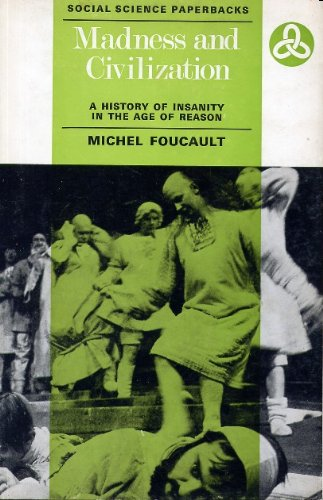
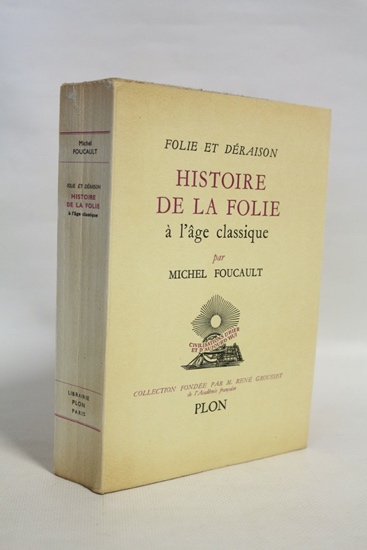
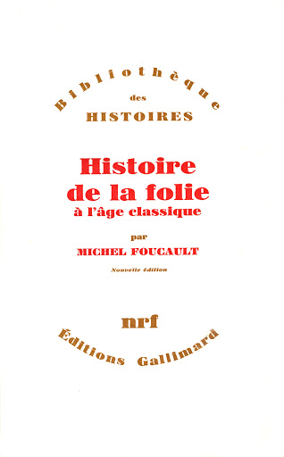

<!--**Tuesday 3^rd^ -Wednesday 4^th^ August**-->

In which, not really having had a summer holiday, due to COVID etc, I
continue working on R13, as I am now naming it as a shorthand.

## Schematic chronology of R13 

This will be ongoing -- need to establish a proper chronology with
R13/CERFI events mapped against [[Foucault]], [[Deleuze]],
[[Guattari]] etc and State events. \[**See Chronology\]**

- September 1971 -- Response to offer of funding -- Drafting of Chapter 1
'La Ville-ordinateur'

- May 1972 -- discussion Guattari, [[Fourquet]], Foucault (pp. 27-31)

- \[June 1972?\] 6 months of funding for exploratory research (the key
questions are: Is there a specificity to the urban? What is meant by
'Genealogy'?)

- July 1972 publication of *Les Temps modernes* issue *Nouveau fascisme,
nouvelle démocratie*

- September 1972 -- discussion Guattari, Fourquet, Foucault (pp. 27-31)

- October-December 1972 'la toupie folle' -- intensive drafting of texts

- October 1972 -- 'regulation' of 'Ville-métaphore' (Chapter 2)

- October 1972 -- [[Vernet-Stragiotti|Marie-Thérèse Vernet-Stragiotti]] goes on holiday

- November 1972 -- 'première mouture'

- November 1972 -- drafting of Chapter 2

- Arrival of FHAR adherents

- March 1973 Publication of R12 *Trois milliards de pervers*

- December 1973 -- Publication of R13

## Notes on Chapter 4

Chapter 4 -- 'La Formation des équipments collectifs' is announced in
the preface as inaugurating a change of object and method; confronting
collective equipment head on, and incorporating *genealogy*. This is
where the influence of [[Nietzsche]]'s *Genealogy* is most explicit,
although previous chapters include references to it. The first section
of the chapter is titled 'Nietzsche se met de la partie, et en change le
cours'.

It makes sense then that the chapter begins with a long quotation from
the Hildebrand and Gratien translation of Nietzsche's *Genealogy*, which
we can recall had been published in May 1971 as volume 7 of the new
complete works established by [[Giorio Colli]] and [[Mazzino Montinari]] under
the direction of [[Deleuze]] and [[Maurice de Gandillac]] (see **Nietzsche
dossier**). The quotation comes from Section 12 of the 'second
dissertation' on 'guilty conscience'.

The key idea here is that the notion of utility which is invariably used
to explain, for example, the function of punishment, is a retrospective
*interpretation* on the part of a superior power in view of subjugating
and dominating, and which obscures the previous usages. Goal or aim and
utility are rather *symptoms* of a will to power which has 'captured'
(*s'emparé de*) something less powerful.

The first point made in R13 is that this view is radically different
from the Hegelian conception of history, and from its Marxist inversion.
A comparison is made via a quote from [[Hegel]]'s *Phenomenology of Mind*,
in its 1939 translation by [[Jean Hyppolite]]: the truth is its own
becoming... the problem this conception poses for the R13 group is that
the 'truth' of collective equipment would always be supposed as
original, and as ultimate resolution. Any discontinuities in the history
of collective equipment would be mere mediations of negations in their
self-becoming. There is no origin, write R13, but rather 'coups de
force'.

'Function' is thus redundant, and collective equipment cannot be
explained by usage within a 'system of needs'. This is a major insight
or provocation of R13, which I'd say somewhat subverts the initial brief
from the Ministry, - what is the social need or demand for collective
equipment? What needs to be understood and brought to light, rather, is
the 'coup de force' which 'gave birth to it' (*naissance*) as an
*instrument* of subjugation. After Nietzsche, 'use' must be seen as an
*effect* which has imprinted on collective equipment the meaning
(*sens*) of a function. The Nietzschean term *interpretation* is slanted
towards the Deleuze/Guattarian terms of *inscription* and *coding*, or
more precisely, collective equipments are inscribed as instruments of
coding and exclusion of free social energy.

\[The later discussion with [[Guattari]] suggests that this schema is too
simplistic -- collective equipments not as instruments of coding, but
effects, again, of a more anterior *axiomatic*\].

Along with the system of needs, what is also criticised is the
concomitant idea of a Subject (social or individual) of these needs, and
classical economics is supposed guilty of such a postulation. Moreover,
the idea of an 'unconscious' subject of needs, or who needs, is no less
transcendent and to be rejected.

The mode of production of collective equipment (Marxist vocabulary) is
distinct, then, from the uses which result from them, or to which they
are put. Rather, what 'coup de force' or 'administrative decision'
(suggestive vocabulary here, hinting at the contemporary regime and the
research project itself, the Plan) was at stake, and what 'mobile mass'
or 'flux of people' or 'rebut social' (social rejects?) was fixed,
territorialized, subjugated... What was the event at which or through
which desire in the social order emerged and was fixed in collective
equipment?

\[So here we have again the quite straightforward idea of collective
equipment as the territorialisation, the fixing, of social desire, or
social flux...\]

The underlying reference here is to [[Foucault]]'s *Histoire de la folie*,
and madness is presented as a paradigm of the 'wild' or 'uncivilized'
social flux which is only utterable or sayable at the moment it is fixed
in a structure: 'faire une étude structural de l'ensemble historique ...
qui tient captive la folie dont l'état sauvage ne peut jamais être
restitué en lui-même; mais à défaut de cette inaccessible pureté
primitive, l'étude structurale doit remonter vers la decision qui lie et
sépare à la fois raison et folie'. This is taken from the preface to the
1961 (first) edition of *Histoire de la folie*, published by Plon with
the title *Folie et déraison*, a preface substantially transformed for
the 1972 re-edition. The full quotation is as follows:

> Faire l\'histoire de la folie voudra donc dire : faire une étude
> structurale de l\'ensemble historique - notions, institutions, mesures
> juridiques et policières, concepts scientifiques - qui tient captive
> une folie dont l\'état sauvage ne peut jamais être restitué en
> lui-même ; mais à défaut de cette inaccessible pureté primitive,
> l\'étude structurale doit remonter vers la décision qui lie et sépare
> à la fois raison et folie ; elle doit tendre à découvrir l\'échange
> perpétuel, l\'obscure racine commune, l\'affrontement originaire qui
> donne sens à l\'unité aussi bien qu\'à l\'opposition du sens et de
> l\'insensé. Ainsi pourra réapparaître la décision fulgurante,
> hétérogène au temps de l\'histoire, mais insaisissable en dehors de
> lui, qui sépare du langage de la raison et des promesses du temps ce
> murmure d\'insectes sombres.

The citation from Foucault's 1961 preface is significant, because it
hones in on a sentence elided in the 1972 preface, and one which
(according to [[Jean Khalfa]] in his introduction to the translation
into English of the full text with its variants) was significant for
the anti-psychiatry movement, at least for [[David Cooper]] in his
introduction to the Tavistock Press 1967 translation of the work, who
refers to madness as a 'lost truth'. The idea of a 'wild state' of
madness, or, as the (progressively downgraded) title of the 1961
edition has it, *déraison*, resonates well with the idea of nomadic
fluxes that are fixed and territorialized by collective equipments,
or, in Foucault's schema, by reason, and later, discourse. The notions
of 'état sauvage', 'inaccessible pureté primitive' and 'murmure
d'insectes sombres' betray a somewhat romanticized idea of fluid,
nomadic desire and expression which the R13 group seem prey to at this
point. The R13 team presumably have access to the 1964 10/18
(abridged) edition, and to the 1972 Gallimard full text (with revised
preface; the one mentioned in the R13 bibliography and notes) but
choose pointedly (and explicitly) to refer to the 1961 preface, which
they also highlight in the bibliography.

So R13 extend Foucault's conception of the event of a 'partage' between
reason and unreason, and the consequent discourse on madness, to all
kinds of flux which 'only appear decoded and free' at the point when
they are 'civilized'. But not only this, they continue, all these fluxes
and flows are *madness itself* (it's not only an analogy); 'folie' is
the name for all fluxes which are decoded or uncoded, dissociated. The
idea here relates to a point in *Histoire de la folie*, repeated in the
'medical equipment' chapter, which is that the 'hospital' was, in the
pre-modern era, a site for the 'care' and then 'internment' of the poor,
the mad, the sick, etc, i.e. the nomadic, those who were not part of the
economy of production and of the family. The 'hospital' is thus there to
'recode', reterritorialize, fix, normalise, register, represent this
quotient of humanity and give them the figure of a 'person'. The
*person* is a key figure here, which seems to operate as a form of
territorialisation in itself.

The discussion moves on to stress the *discontinuous* character of the
'coups de force' which instigate collective equipments as modes of
territorialisation. There is neither a social consciousness at work, nor
a material logic. It is a question of emphasising and putting into play
the *differences*. No historical dialectic. The succession of
'formations of equipments' is accidental (backed up with a clause from
the Nietzsche quotation already cited). What is essential is the process
of 'subjugation' which puts them to work.

Return to *Genealogy*, and to the earlier quotation. Nietzsche says that
the 'meaning' or 'concept' of punishment is a difficult synthesis of
different interpretations; it is a 'unité difficile à résoudre' and
impossible to define. Presumably because there is no linear cause-effect
or need-satisfaction logic to it, but rather an amalgam of uses promoted
by forms of instances of subjugation. The presupposition, then, is of a
*radical heterogeneity* of the meaning (concept) of collective
equipment, despite its apparent derivation from the time of the
Liberation (see later); the questions are: what does it replace, what
objects does it designate, in what discursive formations it is present?

This opens up the possibility of a discursive history, or genealogy
rather, of the notion itself, which does not remain at the level of
vocabulary, since it can have other names...
