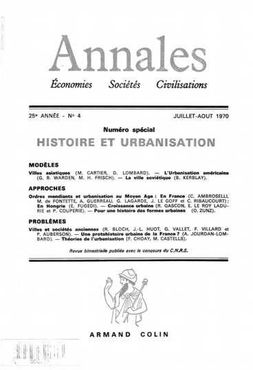
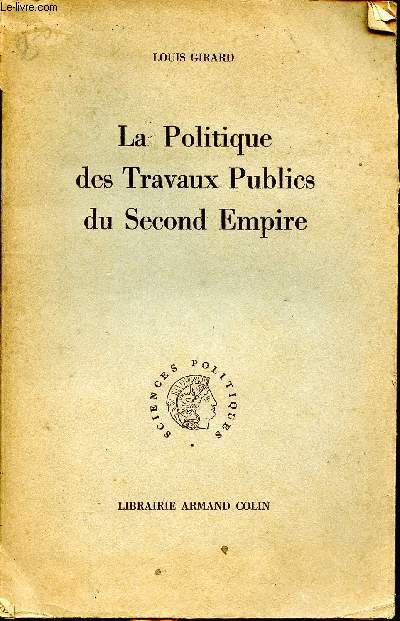
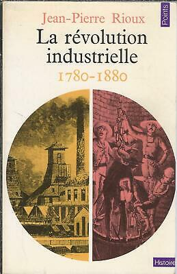
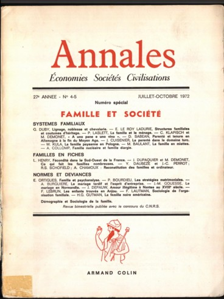

\[Found online a 2015 PhD thesis (Picardy) by [[Antoine Idier]], *Les
vies de [[Guy Hocquenghem]] Sociologie d\'une trajectoire à
l\'intersection des champs politiques, culturels et intellectuels
français des années 1960 aux années 1980*, with much on the political
and radical contexts around '68, and details on CERFI\]

*Continuing on genealogy and the concept of collective equipment:*

The *concept* of collective equipment is thus not assured (in the
Hegelian sense of coinciding with its object), 'La généalogie, ici,
fonctionnera comme puissance d'éclatement du concept'.

There follows a note on terminology, that of 'inscription' and
'enregistrement', which might imply an agent, and thus a 'culturalist'
approach. A long footnote here the text points to an article by
[[Francoise Choay]] (whose 1965 *Urbanisme* book was a key ref. for Chapter
1). The article referenced 'Histoire et méthode en urbanisme' appears in
a special issue of *Annales* on 'Histoire et urbanisation' of
July-august 1970. Choay is criticised, again, for having postulated an
unconscious, transcendent subject or agent of urban development.

	

(Choay's article is available [via
Persée](https://www.persee.fr/issue/ahess_0395-2649_1970_num_25_4))

Inscription is not made by a process of writing, but a 'social and
material process' through which the material forces of the unconscious
'fluides et libres', come to be fixed and stuck on the social body,
where they function thereafter as rigid and closed systems of relations
of force, coded and institutionalised relations of production.' (more or
less translating here).

So fluid desire on the one hand, fixed or territorialised relations on
the other. I wonder about this notion of the 'material forces of the
unconscious'. *Anti-Œdipe* seems more complex in its picture of this
process.

'Enregistrement', on the other hand, designates the way in which a
social power (State, capital, oriental despot) impresses on these
relations of production 'the form of its domination and the rules of
their functioning'.

A historical case follows: the masses (individual and collective)
liberated at the end of the 18thC by the failure of previous systems of
relations of production and of social institutions only function in the
'frame' (*cadre*) of the capitalist mode of production once they have
been 'registered' as 'working class' or as an identifiable and nameable
group of workers. This entails also the rejection of the mass of
'barbares' (sauvages?) 'entassée dans les bas quartiers des villes'. For
this, say R13, criminality had to be invented.

NB. If this draft can be placed in late 1972, it is significant that
Foucault is lecturing at the Collège de France on 'Théories et
institutions pénales' from Nov 1971 to March 1972, and then on 'La
Société punitive' from Jan 1973 -- March 1973.

The second section of Chapter 4 concerns the 'conjugal family', the
thesis being that the State creates collective equipments as a kind of
prosthesis for the family.

The history of collective equipment is as discontinuous as its concept,
yet it is important to focus on the period of the Revolution and the
Empire. There is a presupposition, provisionally, of a 'system' of
collective equipment'. What is certain is that there is a genealogically
founded relation between the system of collective equipment and the
putting in place of the Napoleonic state on the ruins of the Ancien
Régime. We are marked by the Napoleonic State, say R13. A series of
disjunctions and exclusions e.g. family-civil society/State;
public/private etc, all founded on the category of the person. There is
a citation from [[Hegel]]'s *Philosophy of Right* pointing to the universal
category of the person. Spaces of inclusion and exclusion :
hospital/asylum/school/pègre/. A pratico-inert universe sealing any
threat that the mass could 'fusion' into a 'masse-sujet', 'foule libre'
(ref. to Revolutions of 1848, 1871). \[Note the Sartrean terms here\].

The family as a unit of production is shattered, artisanal production is
marginalised. Work is organised around machines. 'Tout ce que la
fabrique ne parvient pas à fixer se retrouve errant, hémorragie qui
coule des ruines des métiers ou des familles paysannes, mendiants,
indigents, vagabonds, nomades des temps modernes.'

The logic here is of fluxes and codes; what was fixed and coded by the
expanded family is destroyed by capital which in destroying former modes
of production destroys this system of 'fixation' and liberates flows
('redoutables') which need to be neutralised and fixed in turn.

\[Cf. later, [[Guattari]]'s disagreement with this model\]

Populations flow towards the cities where there is no system of
'codage'. The 'grand enfermement' of the 17thC and the general hospital
are the prototypical event for collective equipment. Reference here to
[[Braudel]], *Civilisation matérielle et capitalisme 1* on the number of
abandoned children at the end of the 18thC.

The chapter moves on to describe, with reference to Chapter 5 of
[[Foucault]]'s *Naissance de la Clinique*, 'La Leçon des hôpitaux', the
'hesitation' at the time of the Revolution between care in the family or
care in the hospital (risk of hospital illnesses). i.e. illness is not
separable from the question of the family. The dichotomy --
family/hospital -- is reproduced in the current debates on sector
psychiatry \[*and still!*\]. But the real problem is that the family
cannot contain the mad, and thus a social territory must be found for
them -- the hospital. Confusion of 'assistance et soin' (welfare and
care?). Collective equipments are needed, e.g. in 1794, because of the
consequence in terms of indigence and vagabondage. 'On craint les
mouvements populaires', unattributed, but is another citation from
Chapter 5 of *Naissance de la Clinique* where Foucault discusses the
re-organisation of the hospitals during the Revolution. The summary
conclusion is that: collective equipment is the non-familial territory
over which the State exerts its sovereignty directly.

So the 'sealing' of the threat is not done by capital, but by the State.
The general hospital is on the basis of complicity between absolute
monarchy and the bourgeoisie, the Church cut out of the deal.

Whenever something escapes from the family, the State differentiates
itself and creates a specific organ to deal with it. Thus emerges a new
species of collective equipments. Territorial 'quadrillage' (grid);
anything susceptible to flow (*fluer*) triggers a new collective
equipment. Sector psychiatry is a priority for the desire of the State.

But this collective equipment soon becomes redundant: 'ça fuit de toutes
parts, vite, un nouvel equipment collectif!'. Adjacent or peripheral
collective equipments are added to recuperate the 'ratés' etc.

This 'obsession' with fixation of manpower is accelerated as new and
more massive potential forces of production (and of subversion) develop
in tandem with the rise of industrial capitalism. Reference here to the
Charter of Athens and to its 'famous' 8^th^ point about the 'chaos'
which entered into the cities at this time.

	

The question is -- is this the 'chaos' or disorder of urbanism, (as the
'context' \[i.e. architecture, urbanism\] Charter of Athens or a
geographer [[Pierre Georges]] would suggest, or does it refer to the mass of
semi-proletarians and the unemployed, 'le nom noble de la pègre'. The
masses uprooted by capitalism and drawn to cities needed to be
'occupied'. Thus grand works, public work programmes, and railways etc.
Large urban projects. 1848 -ateliers nationaux' of 1848.

The Pierre George (a 'precursor' in urban studies) reference is to
*Géographie urbaine,* pub. 1961 by PUF, (another scholarly work).

	

A footnote cites George, pointing to the contradiction between the
'creative power of liberal economics and speculation' and the 'logical
ordering of cities'. The resonance with [[Le Corbusier]] is underlined.

A further scholarly quotation from [[Louis Girard]], *La politique des
travaux publics sous le Second Empire*, [[Armand Colin]], 1951. This
one is about the 'ateliers nationaux' which functioned as a kind of
'army' depot for masons and unemployed diggers.

And, à la Foucault ('grey' work in the archives) -- a quotation from
'Merreau' from 1851 comparing workers making sewerage and gas piping to
protesters making barricades with the 'pavés'. Evidently this quotation
has some bite at this moment (barricades, paving stones). 'La
comparaison est saisissante', an aside, is telling. The unreferenced
quotation is from [[Charles Merreau]] (1807-1882)*,* former General
Secretary of the Prefecture of the Seine, *Souvenirs de l'hòtel de ville
de Paris*.

Thus a little known dimension of the 'great works' (grands travaux),
which at the time were called 'équipments nationaux', to make barracks,
prisons and 'fabriques' (factories) near the national workshops to 'fix'
'la main d'œuvre'. A 'secret dimension' of collective equipment -- the
construction site of the grands travaux as a nomadic collective
equipment, a mobile territorialisation of a flux of uprooted workers or
unemployed under the direction of the State.

Movement from a 'revolutionary energy in reserve' in national workshops
to an energy productive of use value and surplus value. The dilemma:
barricades or grand travaux? The unoccupied workforces, a consequence of
growth, appears as a dominant motive for the accumulation of capital;
capitalism exorcising the demons to which it had given birth. The
construction of collective equipments thus as a use of productive forces
at the same level as colonisation.

Then this, which is tricky: As soon as it is a question of freezing the
overproduction of capital, it sees no difference between productive uses
and unproductive uses; everything is useful since it contributes to
maintain the forms of the production of surplus value.

What is tricky here is what is meant by 'improduction' \[see later
discussion with Guattari).

I think the point is that collective equipment is not productive in
itself, i.e. a hospital, railway, etc is not a profit making exercise,
so it looks something like a safety valve of a sort to manage the labour
forces when productivity reaches a certain threshold.

A note on the factory -- it is inherent to capitalism and to its
territory; it is collective equipment par excellence even though it is
not classified as such. (?) It fixes the new 'savages' to the territory.
A reference here to [[Jean Pierre Rioux]], *La révolution industrielle*,
Seuil, Points 1971. Rioux was 'maître-assistant d'histoire contemporaine
à [l'université de Paris
X](https://fr.wikipedia.org/wiki/Universit%C3%A9_de_Paris_X) Nanterre
entre 1970 et 1980' and on the committee of *Esprit*.

But this was not always the case, e.g. glass workers at Carmaux (town
known for glass work in the Tarn) were mobile, and only fixed in the
second half of the 19thC. This progressive fixation needs to be studied.

Class consciousness, wage claims, strikes... the working class appears
to have always been 'coded' but was coded on the very site of the work,
which is only a production of surplus value on the condition of the
exercise of capitalist despotism (this is not so clear!). I think the
point is that the workspace is hierarchically organised on a despotic
model. Another unclear point about capital delaying bureacratisation,
which, they say, is not inherent to capitalism -- see contemporary
attempts at 'management' through decentralisation, self-organisation of
workers as collectives, freedom to organise time, on condition of
satisfying the quantitative criteria of profit. I think the point is
that despotism or 'self-management' are equally valid modes of capital,
as long as the profit is maintained. Again see later discussion
Fourquet-Guattari.

Still on industrial capitalism -- the factory destroys social links; the
despotism of the factory replaces the dislocated family models. Further
quote from Rioux about English workhouses.

So why does the family still function? Answer: It's not the same family.
The *expanded* family has been replaced by the *conjugal* family. A note
here points to a special issue of *Annales* on 'Famille et société' from
July-October 1972.

The issue includes articles from [[Georges Duby]], [[Emmanuel Le Roy Ladurie]],
[[Pierre Bourdieu]]; the note says that the question has to be
nuanced as some historians find it peremptory.

Lateral alliance of couples replaces generational filiation. Inheritance
replaced by contract. \[see *Anti-Œdipe* on this\]. The originary
functions of the family are taken on by collective equipment. The new
family is thus a kind of prosthesis for the new mode of production.
Collective equipments, alongside the factory and the habitation are: 'un
dispositif d'ensemble soutenant l'existence de la famille conjugale'.
\[NB use of later Foucauldian term *dispositif\]*. Collective equipments
are thus articulated with the family habitation and the 'activities' of
factories, office, businesses etc. Whence the insistence of the Charter
of Athens of the 'cell' or family unit (house) as the starting point of
the operation of urbanisation.

Collective equipments as non-familial territory and external condition
for the functioning of the conjugal family.

\[NB. The resonance of this with *Anti-Œdipe* and the theses of
anti-psychiatry. [[David Cooper]]'s *Death of the Family* translated in
Seuil's 'Combats' collection and the 'Points' in 1971 and 1972. See also
Cooper's *Psychiatrie et anti-psychiatrie*, coll. Le Champ freudien,
1970\].

New section on production and non-production or 'anti-production'.
Productive and unproductive sectors. Social classes are valued for their
productivity. In other words, capacity to produce surplus-value.
Everything else is in the domain of non-production. E.g. the State. Or
it is invisible -- this is the domain of collective equipment.

The class struggle is highly visible, but collective equipments are
concerned with the 'unclassifiable', the masses of those who are neither
this or that; they are 'hors-capitalisme', 'hors règles-du-jeu,
hors-la-loi'.

Is it then a sort of territory of the unclassifiable? But rather to see
things from this perspective -- a counter-history of the domain of
non-production, a result of the triumphant capitalist 'distribution'
(*partage*). The history of collective equipments can only be effected
on condition of putting this distribution radically into question. A
mode of inscription of the real processes of production which separates
the productive from the unproductive. But processes of production and of
anti-production function everywhere, in 'production' as well as in
'non-production'.

This is tricky, again. The punctuation implies that there is on the one
hand a schema whereby capitalism defines (or inscribes) production, and
classifies what is not productive as unproductive, on the other hand a
'wider' sense of production (not in inverted commas) in which both
production and anti-production are modes of production.

Production and anti-production are indissociable; the inscriptions at
the level of the social (between State, capital, family) are not known
at the unconscious level. The unconscious is not transcendent in
relation to social relations. In other words there is not, on the one
hand, the social domain, and on the other a 'lower' level of unconscious
processes. The unconscious is immanent to the social field. The relation
is not of hidden to manifest, under to higher, but production and
registering, connection to disjunction, free energy (sexual as well as
social) and coded, fixed, stocked energy... flux/frozen, crystallised
fluxes...

So the matrix is not determined by the opposition between production and
anti-production, but between flow and cut, energy and recording
(capture).

So they are not thinking of collective equipment on the model of need,
of which the State would be the interpreter (the oracle of modern
times). The subject of need is an effect of the mechanisms which
inscribe a subject of need.
