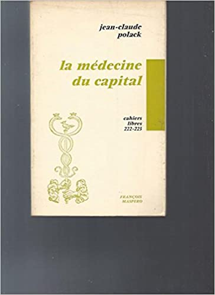

Still at the desk, although I have been to my office in KCL to
recuperate various books I thought useful. This time I am looking at the
'Medical equipment' section of Chapter 4, which has entailed reading
around [[Foucault]]'s *Histoire de la folie* and *Naissance de la Clinique*.

**Les équipments médicaux**

1963 Publication of Foucault's *Naissance de la Clinique: une
archéologie du regard médical* in the collection 'Galien', 'Histoire
et philosophie de la biologie et de la médecine', PUF, directed by
[[Georges Canguilhem]]. Revised edition 1ere trimestre 1972. Published
simultaneously with *[[Raymond Roussel]]*, coll. 'Le Chemin',
Gallimard, nrf, directed by [[Georges Lambrichs]]. The preface points
to the influence of Canguilhem (on the normal and the pathological)
and [[Maurice Merleau-Ponty|Merleau-Ponty]] (in the visible and the
invisible), while the division between spatialisation and
verbalisation, seeing and saying, echoes the terms of *Raymond
Roussel*.

[[David Macey]] draws attention to the importance of 'le regard' in the
subtitle, evoking [[Sartre]], but the term 'archaeology' has more valency,
prefiguring the later 'archaeology of knowledge', and the reference to
the archive, whence the voluminous bibliography. The 1972 revisions to
the 1963 edition replace some of the appeals to 'structure' with
'history', e.g. 'Ici, comme ailleurs, il s'agit d'une étude
~~structurale~~ qui essaie de ~~déchiffrer~~ dans l'épaisseur ~~de
l'historique~~ les conditions de son histoire elle-même' becomes: 'Ici,
comme ailleurs, il s'agit d'une étude qui essaie de **dégager** dans
l'épaisseur du **discours** les conditions de son histoire'. [[Elden]] has a
brief [blog
post](https://progressivegeographies.com/2019/02/11/which-edition-of-foucaults-birth-of-the-clinic-did-alan-sheridan-actually-translate/)
on the subject, and points, as does [[Macey]], to [[Bernauer]]'s study of the
revisions in *[[Michel Foucault]]'s Force of Flight*. The key question for
us is which edition do the R13 group refer to. The bibliography says
1963, though the footnotes (e.g. p. 148) says 1972.

Reading the chapter 'Les Équipments médicaux' in R13...

Emergence of the couple normal/pathological in the 19thc. From two
postulations: 1. illness is an essence, or a specific entity; thought in
terms of botanic species (e.g by [[Kraepelin]] on schizophrenia) 2. Illness
is a deviation in relation to nature. The references here are to
[[Durkheim]] (statistical norm) and [[Ruth Benedict]] ('pattern'). Neither are
footnoted or in the bibliography. \[Benedict, *Patterns of Culture*,
1934; *Échantillons de civilisation*, 1950\].

Focus on 'équipement sanitaire' thus instances of conformity in relation
the norm of *health*, but the notion of the hospital as a site of care
only developed slowly through ruptures and displacements; the idea of
'normal man' thought as anterior to any illness is a 'creation of the
19th century'; in order to understand how illness became a mode of
deviation and the ill person a deviant, we need to undertake a genealogy
not of illness itself but of what constituted it, i.e 'hospital
equipment' \['l'équipment hospitalier'\]

*Care* as such is a recent invention; it had to be dissociated from
poverty. It is from the fracture of indigence and illness that the
modern hospital was born as a site of care.

The norm of health had to be distinguished from the norm of work. The
early hospital as a site of enclosure (*enfermement*). Beggars (nomads)
were excluded from the city and interned. Thus the idea of the
'hosp-ital'. The reference here is to [[Gaston Roupnel]], *La ville et la
campagne au XVIIe siècle. Etude sur les populations du pays dijonnais*, 1955.
This work is in the bibliography, published by SEVPEN (Service
d\'Edition et de Vente des Publications de l\'Education Nationale).
Roupnel, b. 1871, d. 1946, friend of [[Gaston Bachelard]]. It is not cited by
Foucault in *Naissance de la clinique*, but is by [[Braudel]] in *La
Méditerrannee* and *Civilization et capitalisme*.

Move (*glissement*) whereby the place of internment takes on an ethical
vocation. The hospital as a place of *correction* to bring the nomadic
and poor back within the realm of productivity. Reference here to
Foucault's *Histoire de la folie*, on the hospital in the pre-modern
period as 'a forteresse de l'ordre moral', in the chapter on 'Le Grand
enfermement' where Foucault is discussing the workhouses of protestant
Europe of the 17thC.

But suddenly internment encounters limits. 1749- arrest of all beggars;
1765 creation of centres for beggars (*depots de mendicité*) \[discussed
by Foucault in *Histoire de la folie* chapter on 'Le Nouveau partage'\].
The idea of the hospital as a place of 'assistance' and repression of
unemployment is put in question. The moral question of poverty etc
becomes an economic question, insofar as rather than being put out of
circulation in spaces of internment, the poor become a cheap labour
resource.

The inherent contradiction of the mixed economy in the hospital thus
needed to be dissociated; indigence and illness needed to be
distinguished; the poor and ill was the negative element par excellence;
needing 'assistance totale'; illness separated from poverty;

But illness was immediately separated from the hospital; the hospital
seen as the creator of illness and the family as the site of cure (this
is familiar from the first few chapters of *Naissance de la Clinique*,
chapter on 'Le Champ libre', pp. 38); illness should disappear in the
natural milieu of the family.

The hospital as recompense for the family, and symbolically constituted
in relation to it. The doctor as father and judge, on the model of the
Father; hospital as microcosm of bourgeois social structures.

The Revolution: sought to abolish the charitable function of hospitals
and make them attain a 'social duty'. The general hospital as having a
social function. Ref. to Foucault *Naissance de la clinique* on the
'contractual' relation between the poor whose treatment is paid for and
right for whom this knowledge may be useful (p. 85, chapter 'La Leçon
des hopitaux'). Ref. to [[Maurice Rochaix]], *L'évolution des institutions
hospitalières de l'ancien regime à nos jours,* ed. Federation
hospitalière, 1959. Not in *Naissance de la clinique*. Rochaix was
president and founder of the society for the history of hospitals and
was himself a hospital director.

Doctors nevertheless have a specific knowledge independent of hospitals
'savoir noseographique'; epidemics as a salient issue; power decides to
take medicine in hand faced with the ravages of epidemics'; create a
knowledge turned towards the population in the form of prescriptions;
'constitution d'un sur-savoir retourné en pouvoir'. Creation of Royal
Society of Medicine in 1776.

This broadly follows the narrative of *Naissance de la clinique*.

The revolution: turned this power into collective equipments accessible
to all, collective equipment without State apparatus' ('un equipment
collectif sans appareil d'Etat'); because medical space coincides with
social space; the medicine of classes = free circulation = homogenous
social space -- 'rêve démocratique'.

Hospital structures put into question -- nationalisation of hospitals --
social assistance and repression (of illness) are dissociated (ref. to
*Naissance de la clinique*). But social assistance is medicalised in its
turn and takes on a new function -- *prévoyance* -- (prevention) --
creation of *Caisses de Retraite and Caisse Nationale de Prevoyance*.
Replacement of centres for beggars;

Para. p. 152 follows [[Foucault]] exactly in linking the enunciatory power
arising from the medical 'regard' to police surveillance of the
population, doctors-police-prison; linked to the Charter of Athens;

Reaction (post revolution) attempts to reinstitute the charitable order
but comes up against a new power which is that of medical knowleldge --
practice and teaching and giving the doctor the power of enunciation.

Still following *Naissance de la clinique* and citing its references,
but adding Haroun Jamous contribution to a University (Paris 7)
collective publication on medical sociology.

Reduced role of the State, except as police... social assistance
reduced. The hospital increasingly a space of return to work...

Important reference to [[Jean-Claude Polack|J. C. Polack]], *La
Médecine du Capital, Maspero, 1972, Cahiers libres 222-23.*

The conclusion to the chapter summarises and interprets: the 'equipment
of health' is an instance of conformity to a norm, the genealogy of this
collective equipment involves an account of the nature of this norm and
how the equipments realise it. The norm of health and thus the
collective equipment of health must be linked to the social power or
norm and the realm of work and production; those who don't work must be
fixed, territorialised. There is a substantial quotation here from
Jean-Claude Polack's 1972 book *La Médécine du capital*, published in
Maspero's Cahiers libre collection in 1972.

\[Cahiers libre was a collection with an important radical standing
and legacy, having published [[Paul Nizan|Nizan]], 
[[Frantz Fanon|Fanon]], [[Che Guevara|Guevara]], the Mouvement du 22 mars,
[[Maria Antonietta Macciocchi|Macchiocchi]],
[[Manuel Castells|Castells]], [[Catherine Bernheim|Cathy Bernheim]] on 'droit à
l'avortement'; connections to CERFI include [[Roger Gentis]], *Les
Murs de l'asile*, 1972\]. Indeed Gentis ran a new psychiatry
collection, so ordained by Maspero. [[Guattari]]'s *Psychanalyse et
transversalité* was one of its first publications. Maspero's
publishing series and bookshop was a key site for the ferment of
militant leftist groups around 1968 and after\].

Medical knowledge cannot be dissociated from its equipment, that is the
organised field of its usage. Is medicine defined by its equipment?
Non-medical treatments and equipment are rejected outside the 'concrete'
(le béton). It remains a servant of the State.
