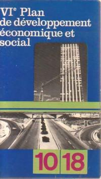

Now looking at Chapter 5 of R13, 'Le Discours du Plan'. Will come back
to the various introductory parts which include a discussion between
[[Deleuze]], [[Foucault]] and [[Guattari]] and a subsequent summary
around 'logical categories' of collective equipment, then
'interventions militantes' from [[Marie-Thérèse]]. The various sections
thereafter go through each of the 6 plans.

Understanding and documenting this discussion involves setting out the
history of the French State's plans and the administrative structures
involved. After several unsuccessful attempts to find a digital version
of the ONU Bulletin No.5 on 'Installation et services collectifs', which
R13 say is the origin of the idea and expression 'équipment collectif'
(eventually ordered from the BN reproduction dept., but too expensive to
copy), I found digital versions of each of the 6 plans via a French gov
website celebrating the 70th anniversary of the first, the 'Monnet
Plan'. These are the documents to which R13 refer, although they look at
the sixth via its publication by 10/18 (surprising instance of 10/18
publishing State documents!).

So, although the term 'collective equipment' relates to the use of the
term 'collective services' ('*services collectifs*) in the United
Nations report from 1953 (Bulletin no 5 of the 'review' *Habitation,
Urbanisme et Aménagement des campagnes*) R13 focuses in the main on the
6 'plans' (1:
[1946](https://www.strategie.gouv.fr/actualites/premier-plan-de-modernisation-dequipement);
2:
[1954-1957](https://www.strategie.gouv.fr/actualites/deuxieme-plan-de-modernisation-dequipement);
3:
[1958-1961](https://www.strategie.gouv.fr/sites/strategie.gouv.fr/files/atoms/files/troisieme-plan-1958-1961.pdf);
4:
[1962-1965](https://www.strategie.gouv.fr/actualites/quatrieme-plan-de-developpement-economique-social);
5:
[1966-1970](https://www.strategie.gouv.fr/actualites/cinquieme-plan-de-developpement-economique-social);
6:
[1971-1975](https://www.strategie.gouv.fr/actualites/sixieme-plan-de-developpement-economique-social)).

These 'plans' have their origin in the immediate post-war when de [[Gaulle]]
was advised by [[Jean Monnet]] to draw up a strategy for economic renewal
following the war. \[See [[Cobban]] 1965, pp. 218, 244 ff\].

\[Note added later: [[John Ardagh]], *The New France: De Gaulle and After*,
orig. Secker and Warburg 1968: 'the war offered the French a breathing
space in which to re-think the future' (19); 'the most important of
these groups was formed around Jean Monnet in Washington, and out of it
grew the 'Plan' which has played such a vital role in the French
revival' (20). 'belief in expansion and progress'; 'The innovating
technocrat began to come to the fore, in place of the conserving
bureaucrat'; De Gaulle's 'high-handedness' and resignation of liberal
ministers e.g. [[Edgard Pisani]] (first Minister of Equipment); fruits or
prosperity were not shared, leading to greater social division and
failure to devote resources to social progress; May 1968; Monnet's first
Plan for long-term recovery, aided by Marshall Plan (from 1947);
describes the Plan as a 'voluntary and pragmatic association between
State and industry' and points to the 'specifically French' element of
the 'technocrat'; ref. to nightmare vision of technocrats in [[Godard]]'s
*Alphaville*; the main breeding grounds of the technocrats are the
'Grands écoles' e.g. Ecole Polytechnique or Ecole Nationale
d'Administration (ENA) -- 'Some even elevate this (idealistic faith)
into a kind of philosophy; technology is for them a key to human
happiness, and an elite possessed of this secret will guide and save the
world.'

Emergence here (22^nd^ August) of the concept of *technocracy*;
resonances with the arguments of [[Gilbert Simondon|Simondon]].

[[Ardagh]] mentions that the Secretariat du Plan was based in a private
house 'in the shadow of the Ste Clothilde church on the Left Bank' (41).
Mentions that the Third and Fourth Plans 'widened the range to include
social needs, such as welfare and housing' (46)

A lot more on the development of industry, lacks detail on culture. \]

The first plan or 'Plan Monnet', titled 'Premier Plan de Modernisation
et d'équipment', focused on industrial strategy in the context of the
'dilemma': 'modernisation or decadence'. The *Commissariat Générale du
Plan* was established in 1946 to take this forward, with [[Jean Monnet]] as
the lead. The report itself is in the form of a letter addressed by the
Commissariat to the 'advisory group' or 'Conseil'. It stresses the need
for modernisation, for economic stability, and 'collective effort'
(involving the support of Unions). It has a strong rhetorical force,
arguing that modernisation is not only necessary but inevitable if
France is to be a serious competitor on the global stage (that is among
developed States). The problem is set out at the outset -- unless France
develops its own resources it will reply on imports and its financial
reserves will run out. The 4 objectives it sets out are: 1) to develop
national production and exports 2) increase the revenue from work 3) to
ensure full employment of 'manpower' (*main d'œuvre*) 4) to elevate the
quality of life of the population and the conditions of the habitats of
the population. It's worth noting that while the consultations for the
national plan have to a large extent been accomplished, those on the
'territoires d'outre-mer' have not.

The Plan then notes that *social equipment* will involve further
investments in 1947. The main emphasis throughout is on economic
productivity (in comparison to other states which during the war had a
considerable industrialisation e.g. the U.S.). The work of repair
necessitates a substantial investment, particularly as concerns the
'centres nécessaires à la vie ouvrière'. If the fundamental task is to
elevate the conditions of existence of the population, there is only one
efficient means: 'Or, il n\'y a qu\'une façon réelle d\'améliorer le
standard de vie insuffisant d\'aujourd\'hui: c\'est de produire
davantage'. Immigration and the extension of the working day are only
immediate measures. This (fairly cynical) perspective -- more
productivity for the same number of hours -- is to be attained by better
machines and methods. In other words, from a Marxist perspective, the
worker is seen uniquely as a tool, as a 'force of production'.
Previously, it is noted, French workers produced about a ¼ less than
those in the US.

Overall the emphasis on 'equipment' arises as part of the problem and
solution -- France is economically unproductive compared to other
nations. In order to be competitive it has to improve the productivity
of its production i.e. the value produced by each hour of work. It can't
rely on immigration (cheaper labour?) or on more hours of work, thus the
machines themselves must be improved. Equipment is closely related to
the machine. It is a question of 'rénovér l\'appareil et les méthodes'.
E.g. in this proposition: 'la masse d\'équipements qu\'elle exigera sous
forme de machines, de constructions immobilières et de travaux de génie
civil, sera nécessairement très importante' (23). And this sentence is
interesting: 'A l\'intérieur, il faudrait plus de travail pour produire
une même quantité de marchandises et de services. La population devrait
donc ou travailler plus longtemps, et cela d\'une façon permanente, ou
voir ses conditions d\'existence considérablement aggravées, tandis que
les autres pays continueraient de progresser sur la voie du bien-être.'
The first Plan thus establishes a kind of equation between the length of
the working day and social conditions, and 'well-being'. The problem is
also put in terms of the productivity of e.g. 4 hours of French work vis
a vis 1 hour of US work i.e. productivity per hour of work. Monnet seems
to suggest that such a situation, along with the consequent lowering of
salaries is susceptible to produce a 'reaction', hinting at the
(Marxist) analysis that capital gauges working conditions against the
possibility of social revolt.

*Consumption* is envisaged as a consequence of an increased productivity
of labour i.e. it is the necessary resourcing for the labour force. 'On
peut discuter s\'il n\'est pas préférable de développer ou de créer
telle industrie de transformation plutôt que telle autre, quels niveaux
il faut se proposer pour les différentes productions agricoles, avec
quelle rapidité doit se faire la reconstruction, etc \... , mais il est
évident que l\'expansion de la production, dans quelque direction
qu\'elle soit orientée, exigera des quantités considérablement accrues
de charbon, d\'électricité, d\'acier et de ciment, une agriculture
suffisamment mécanisée pour assurer à la population le ravitaillement
necessaire et enfin des-moyens de transport proportionnés'.

Despite what was said earlier, the specific plans for each element point
to the need for immigrant workers, especially since the departure of
prisoners of war will affect the level of manpower! Each of the sections
on the different areas of production underline the lack of manpower.
Drawing on 'non-active sectors' (including 'travail féminin') is
proposed as part of the solution, also including Algerian immigrants.
All of this is on the basis of a 48 hour week, i.e. with an increase
from 40 hours.

There is an important footnote on p. 85: 'Le programme d\'équipement
social (hôpitaux, écoles, crèches, etc\...) n\'a pas encore été précisé,
les dépenses de cette catégorie sont comprises dans la ligne "autres
investissements" et ne sont isolées jusqu\'à présent que pour 1947'.
These 'other investments' are footnoted as: 'Bâtiments et équipements
publics divers (routes départementales, écoles, mairies, etc.),
équipement social (hôpitaux, hygiène scolaire, lutte antituberculeuse,
terrains de sports, etc.) et recherche scientifique'. These are costed
at 80 million francs.

Consumption has to be regulated, the report goes on to say, so that the
French do not consume more than they produce and allow for a certain
amount of investment (saving): 'L\'exécution du plan a également pour-
condition que les investissements somptuaires et mêmes les
investissements utiles, mais moins utiles que ceux prévus par le plan,
soient différés'. 'Il s\'agit de faire en sorte que la production se
relève \'plus vite que la consommation, afin de dégager une marge
suffisante pour réaliser des investissements et des exportations plus
importants qu\'avant-guerre'. There is thus a sort of equation between
production and non-production and consumption, and the global market.
Consumption has to be limited, 'si les Français le veulent'.

As noted above, throughout the report the notion of equipment is used in
reference to the physical machines and raw product needed to increase
productivity. Social equipment is an extension of this. Thus the idea
and expression 'social equipment' is introduced as a kind of adjunct or
extension of economic or industrial, agricultural equipment.

The commission for 'Consumption and Social Modernisation' entails, says
the report, the examination of the 'human and social problems posed by
the Plan'. There is an acknowledgment that the provision of
'medico-social' equipment is insufficient. There are plans for schools,
hospitals and habitations (collective ones are proscribed). P. 197 gives
composition of the commission for Consumption and Social Modernisation.

Moving to R13's analysis of the first report, we see that they underline
the aspect of 'reconstitution', after the damages incurred by the war,
and the orientation of the plan around the notion of *equipment*. They
cite the introductory statement: 'la reconstitution des outillages et
équipments publics et privés endommagés du fait des événements de
guerre'. Although the emphasis of the plan is on economic productivity,
the Plan mentions in the last para. of its introduction, that:
'L\'équipement social, en raison de ses insuffisances actuelles n'a pas
moins besoin d'être développé que l'équipment économique,
essentiellement visé par le décret constitutive et l'un des Commissions
de Modernisation a été spécialement chargée d'en dresser le Plan. Dès
maintenant, une place a été réservée aux hôpitaux, écoles, terrains de
sports, etc. parmi les investissements à réaliser en 1947.'

R13 underline, however, that 'social equipment' is subordinated to
economic equipment (and that a similar proposition is included in the
6^th^ plan, in 1971!, i.e. it is the lowest of priorities): 'La base de
départ sera ainsi créée pour entreprendre, dans une seconde étape, la
transformation des conditions de vie et notamment du logement'.

The 'special commission' mentioned above is the 'Commission pour la
Consommation et Modernisation sociale', the purpose of which, according
to the Plan (as noted above), was to examine the 'human and social side
of the problems posed by the Plan' (173). R13 pick out the mention of
'medico-social' equipment and stress the rapidity with which this is
passed over. They note that there is nothing on education (presumably
Universities).

The analysis in R13 identifies four related terms: **economic equipment
-- production**/**social equipment­­--consumption**. R13 thus identify
the implicit idea here of '*equipment of consumption'*.

Further documents are identified, including the 'report' on the plan
from the 'first semester' 1947, which includes a chapter on 'public
equipment'. Figures are given for the investments in each of several
sectors, including 'equipment social', distinct from
'research-teaching'. R13 detect ambiguity around the notion of
'educative' equipment. In the 'Etat des operations du Plan' from Dec
1949 they find the term 'collective rural equipment'.

In other words, in keeping with the previous section in which R13 stress
the importance of the terminology, (i.e. 'collective equipment' comes
into being as a concept when the expression is used), 'collective
equipment' is non-economic (non-productive), linked to consumption, and
collective, or social, rather than individual.

**The second Plan, March 1956**, makes no mention of collective
equipment (though it does refer to 'equipment scolaire' and 'sanitaire
et social'. The emphasis is on the crisis of 'logement'. This is
referred to as 'social equipment'.

In **the Third Plan (1958-1961)** educational 'equipment' becomes a
'social' priority. There is opposition between 'productive sectors' and
'expenditures of investment of a social character'. In other words
social equipment is seen as an unproductive expense. This reinforces the
distinction of the first plan between economic equipment and social
equipment, but 'economic' becomes 'productive'. Social equipment is seen
as a kind of building. Thus a 'glissement silencieux' whereby 'social'
becomes 'unproductive' + the new category of 'urban equipment'.

**Fourth Plan 1962-1965**. Here the term 'collective equipment' appears
for the first time, and R13 underline this. The 'uses' of consumption
are considered. It is noted that the 'consumer society', assoc. with the
US, veers towards 'satisfactions futiles' which generate 'malaise'.
'Perhaps', the Plan goes, it would be preferable to put progressive
abundance in the service of a 'less partial idea of Man'. In view of a
'greater equilibrium of human groups.' This is a 'texte déjà celèbre' ,
say R13. I wonder why.

Collective equipments are seen as a 'fruit' of expansion: 'la production
est aux equipment collectifs ce que l'arbre est la consummation du
fruit'. The same opposition i.e. productive/unproductive or
production/consumption. But this is supplemented by another opposition
between 'individual consumption' and 'collective consumption'.
'Individual' consumption is associated with the US, which produces
'futile satisfactions' (for false needs). Collective consumption relates
to a 'real need' and a total man. R13 comment: 'on est dans le champ de
l'humanisme.'

Collective equipment is thus immediately and organically linked to the
representation of man but also to 'man in the city and the 'movement of
urbanisation.'

Social is confused with 'public'.

**5^th^ Plan -- 1966-1970**. Collective equipment becomes part of the
language. It is put on the side of (unproductive) consumption. But there
is confusion over where it comes in terms of financing. Collective
equipment is confused with administrative financing. R13 say this is a
'telescopage'.

**6^th^ Plan 1971-1975** -- floating terminology. 'Les mots dansent'.
'Collective function' appears.
