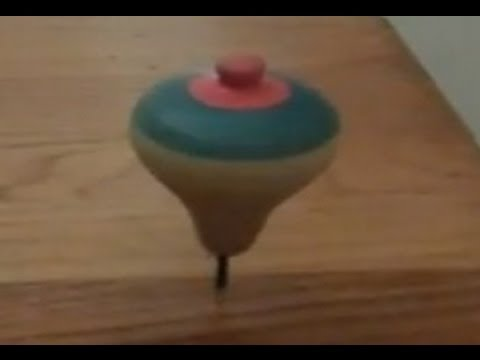

Blog 16 -- 25 February 2022

Conversation with Godofredo

Work conditions and relation to R13

And decision to spin

-- writing in progress --

It's Friday, 25th February.

We had our first conversation piece and it was with [[Godofredo Pereira]].

Our project continues to spin.

Having started in the Summer 2022, this is my second blog post. [[Patrick ffrench|Patrick]]
has been writing with an amazing flow and I really enjoy how we are
developing this project as we go along.

The alternative title 'la toupie folle' or the 'mad spinning top'
reminds us that the project is not just about content, but also about
the devices or mechanisms that we put in place to produce content. 'The
mad spinning top' as Patrick noted points towards a practice of
involuntary spinning and rotation, a surprise element and a rotation. We
discussed that I should take over the blog from Patrick now -- do the
first spin -- and we should spin it again when it feels right.

We have some freedom to experiment, which is unusual in academic
institutions. We have proposed to make a pragmatic genealogy of
concepts. This means inventing a way of capturing the life of concepts
beyond the text exploring its resonances with life -- how concepts are
appropriated and in turn transformed by how they are appropriated.

My own contribution has been subjected to many life and work conditions.
I recently moved to another country, my whole family had Covid and I had
a precarious teaching contract with no time for research, whilst at the
same time, trying to finish my book on the CERFI, so the last 6 months
were difficult with my mind all over the place.

Patrick and I talked about this and how the different work conditions
impact on the project and therefore should - in the spirit of CERFI - be
acknowledged and not be hidden from sight.

Go back to R13 - The fact that the conditions of work and the tensions
there provoked in CERFI enter so explicitly in the text of R13 is a
value.

-- To continue --

Summary of the conversation with Godofredo:

From the conversation with Godofredo, it came about that:

1. We should think more about 'the mad spinning top' and incorporate
elements of rotation in our collective methodology (Susana to take over
the blog? But what if Patrick wants to write ?)

2. How do we refer to the work produced by/on R13, who is the author,
CERFI, R13, the genealogy group -- think about this and perhaps write a
piece about it. Patrick remarked how he realised the challenge when
writing the blog posts.

3. Godofredo suggested the idea of tracing which concepts used in the
research pieces enter into the militant discussions of R13, or which
concepts live in these militant discussions; qua have life outside
theory. He gave an example of his work with students when they go to
fielword.

The dialogue is another 'spinning' device..
